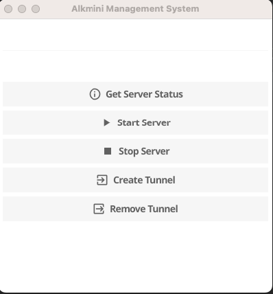
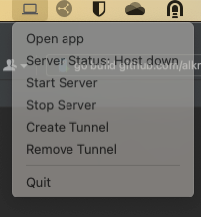

# fyne-alkmini

This is a personal GUI app to manage my lab system from the system tray bar.

The main feature is to control the lab system and show the state of the system.

- start/stop the system
- show the state of the system
- show the state of the system in the system tray bar
- Create a tunnel to the system

## Installation

Mac OS app has been created and can be downloaded from the release page. 

